# RestauracionHoloRed

Link del repositorio: https://github.com/PaxuitoGIT/RestauracionHoloRed

Link de GithubPages: https://paxuitogit.github.io/RestauracionHoloRed/

# Examen Final de Redes II  
## La Restauración de la HoloRed Galáctica

### Introducción

En una galaxia muy, muy lejana, la guerra civil ha dejado la infraestructura de comunicaciones en ruinas. La HoloRed galáctica – la red de comunicaciones casi instantánea de la República, ahora bajo control imperial – se ha visto fragmentada. Los rebeldes luchan por restablecer enlaces seguros entre sistemas estelares aislados. Eres un joven aprendiz de Jedi con talento en ingeniería de redes, reclutado por la Alianza Rebelde para afrontar este desafío. Armado con tu sable de luz y tus conocimientos de TCP/IP, te embarcas en misiones épicas para reconectar la galaxia.

---

## Parte I – Misiones de Conocimiento Teórico (60%)

### **Misión 1: Reconexión en la Base Eco (Hoth) – Direccionamiento IP y Subredes**

#### **Situación**
La Base Eco queda incomunicada tras un bombardeo. Cada departamento (Mando, Defensa, Médico, Hangar) necesita su propia subred IP por seguridad y cantidad de dispositivos. Dispones del bloque 172.16.0.0/24.

#### **Objetivo**
Dividir 172.16.0.0/24 en subredes para cada departamento y una para el enlace troncal.

#### **Solución Detallada**

##### **Análisis de requerimientos**

| Departamento       | Hosts necesarios | Hosts útiles requeridos | Tamaño de subred |
|--------------------|------------------|------------------------|------------------|
| Comando Central    | 50               | ≥50                    | 64               |
| Defensa Perimetral | 30               | ≥30                    | 32               |
| Centro Médico      | 20               | ≥20                    | 32               |
| Hangar y Taller    | 14               | ≥14                    | 16               |
| Enlace Troncal     | 2 (mínimo)       | 2                      | 4                |

##### **Cálculo de subredes (VLSM)**

- **Comando Central**: 64 hosts = /26 (2^6 = 64; 62 útiles)
- **Defensa Perimetral**: 32 hosts = /27 (2^5 = 32; 30 útiles)
- **Centro Médico**: 32 hosts = /27 (2^5 = 32; 30 útiles)
- **Hangar/Taller**: 16 hosts = /28 (2^4 = 16; 14 útiles)
- **Enlace Troncal**: 4 hosts = /30 (2^2 = 4; 2 útiles)

##### **Asignación de subredes**

| Departamento       | Red             | Máscara         | Rango de hosts útiles     |
|--------------------|-----------------|-----------------|--------------------------|
| Comando Central    | 172.16.0.0/26   | 255.255.255.192 | 172.16.0.1 – 172.16.0.62 |
| Defensa Perimetral | 172.16.0.64/27  | 255.255.255.224 | 172.16.0.65 – 172.16.0.94|
| Centro Médico      | 172.16.0.96/27  | 255.255.255.224 | 172.16.0.97 – 172.16.0.126|
| Hangar y Taller    | 172.16.0.128/28 | 255.255.255.240 | 172.16.0.129 – 172.16.0.142|
| Enlace Troncal     | 172.16.0.144/30 | 255.255.255.252 | 172.16.0.145 – 172.16.0.146|

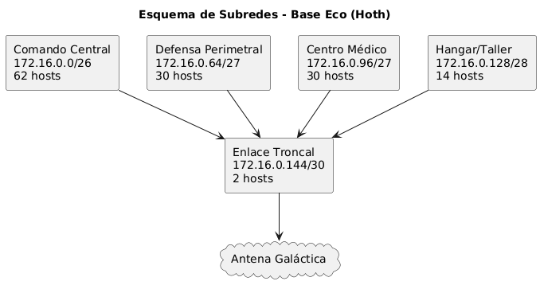

---

### **Misión 2: Sabiduría de Yoda – Algoritmos de Enrutamiento y Rutas**

#### **Situación**
Debes explicar a Yoda la diferencia entre enrutamiento estático y dinámico, y comparar protocolos de vector de distancia (RIP) vs estado de enlace (OSPF).

#### **Respuesta Detallada**

El enrutamiento es el proceso mediante el cual un router selecciona la mejor ruta para enviar paquetes de datos de una red a otra. Existen dos grandes enfoques:

#### **Enrutamiento Estático**

- **Definición:**  
  Las rutas se configuran manualmente por un administrador de red en el router, permaneciendo fijas hasta que se cambian manualmente.
- **Ventajas:**  
  - Mayor control y seguridad, pues solo se permiten rutas explícitas.
  - Consumo mínimo de recursos del router (memoria y CPU).
  - Fácil de implementar en redes pequeñas o topologías simples.
- **Desventajas:**  
  - No es flexible: ante caídas o cambios en la red, es necesario modificar la configuración manualmente.
  - No escala bien para redes grandes o en constante cambio.
  - Mayor riesgo de errores humanos.

#### **Enrutamiento Dinámico**

- **Definición:**  
  Los routers intercambian información de enrutamiento entre ellos y ajustan sus tablas automáticamente, adaptándose a cambios en la red.
- **Ventajas:**  
  - Alta adaptabilidad: actualizan rutas automáticamente ante caídas o cambios.
  - Escalabilidad: adecuado para redes grandes y complejas.
  - Menor intervención humana.
- **Desventajas:**  
  - Mayor consumo de recursos (CPU, memoria, ancho de banda).
  - Complejidad en configuración y administración.
  - Posibilidad de inestabilidad si las configuraciones no son correctas.

#### **Protocolos de Enrutamiento Dinámico**

- **De Vector de Distancia:**  
  Ejemplo: RIP (Routing Information Protocol).
  - Cada router informa a sus vecinos de la distancia (número de saltos) hasta los destinos conocidos.
  - Más simple, pero más lento en convergencia y susceptible a bucles de enrutamiento.
- **De Estado de Enlace:**  
  Ejemplo: OSPF (Open Shortest Path First).
  - Cada router comparte el estado de sus enlaces con todos los routers del área, lo que permite construir una topología completa y calcular la ruta óptima.
  - Más rápido y eficiente, pero requiere mayor capacidad de procesamiento y memoria.

#### **Comparación ante fallos y escalabilidad**

- En redes grandes o cuando un nodo cae, los protocolos de estado de enlace (OSPF) reaccionan más rápido y de forma más eficiente que los de vector de distancia (RIP), pues tienen una visión global de la red y recalculan solo lo necesario.

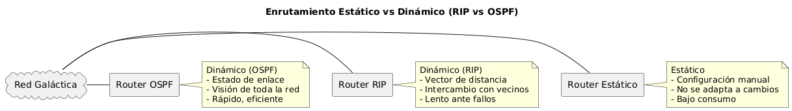

---

### **Misión 3: Los Nombres del Holonet – DNS y Resolución de Nombres**

#### **Situación**
Explica cómo el DNS traduce nombres simbólicos a direcciones IP y su importancia.

#### **Respuesta Detallada**

- **Definición:**  
  El Sistema de Nombres de Dominio (DNS) es un sistema jerárquico y distribuido que permite traducir nombres de dominio, como `holonet.rebelion.org`, en direcciones IP que los dispositivos pueden utilizar para conectarse entre sí.
- **Funcionamiento básico:**  
  1. El usuario solicita acceso a un nombre (ejemplo: `echo.base`).
  2. El equipo consulta a un servidor DNS, que responde con la dirección IP correspondiente consultando sus “registros”.
  3. El registro más común es el **registro A**, que asocia un nombre de dominio a una dirección IPv4.
  4. Si el servidor DNS local no tiene la respuesta, consulta a otros servidores en la jerarquía hasta obtenerla.

- **Ejemplo de resolución:**
  - El usuario escribe en el navegador: `holonet.rebelion.org`
  - El equipo pregunta al servidor DNS.
  - El servidor responde con, por ejemplo: `172.16.0.10`
  - El navegador se conecta a esa IP.

- **Importancia:**
  - Facilita la comunicación usando nombres memorables en lugar de números.
  - Es esencial para el funcionamiento de servicios y aplicaciones en red.

- **¿Qué ocurre si el DNS falla?**
  - No es posible traducir nombres a IP: la comunicación se ve interrumpida.
  - Los servicios que dependen de nombres (correo, web, etc.) dejarían de funcionar hasta restaurar el DNS.

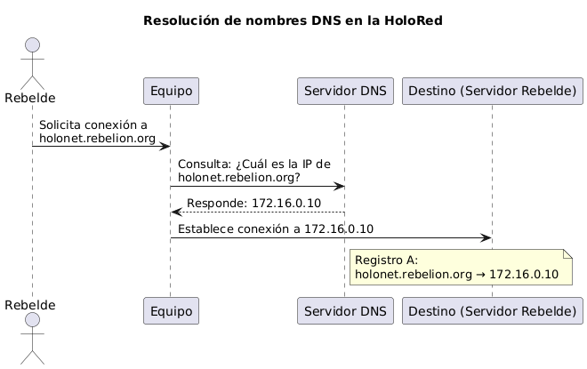

---

### **Misión 4: “Es una trampa… de protocolos!” – TCP vs UDP**

#### **Situación**
Comparar TCP y UDP en la transmisión de datos, con ejemplos galácticos.

#### **Respuesta Detallada**

- **TCP (Transmission Control Protocol):**
  - Protocolo orientado a la conexión y confiable.
  - Establece una conexión antes de transmitir datos (handshake).
  - Garantiza que los datos lleguen completos y en orden, usando mecanismos de control de flujo, confirmación (ACK) y retransmisión.
  - Ideal para transferencias donde la integridad es crítica (por ejemplo, envío de planos estratégicos).
  - **Ejemplo galáctico:** Transferencia de los planos de la Estrella de la Muerte, comunicaciones administrativas.

- **UDP (User Datagram Protocol):**
  - Protocolo sin conexión y no confiable.
  - No verifica si los datos llegaron ni su orden.
  - Menor sobrecarga y latencia, ideal para transmisiones en tiempo real donde la velocidad es prioritaria sobre la integridad.
  - **Ejemplo galáctico:** Transmisión de video en directo desde un X-Wing, o envío de coordenadas de combate.

- **Resumen:**
  - **TCP:** Fiabilidad > Velocidad.
  - **UDP:** Velocidad > Fiabilidad.

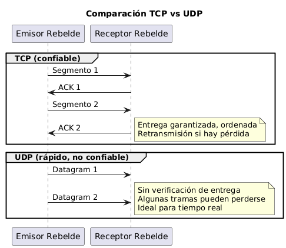

---

### **Misión 5: Comunicación Segura o lado oscuro – Criptografía y Seguridad**

#### **Situación**
Explica la diferencia entre cifrado simétrico y asimétrico, su uso y la importancia de autenticación/no repudio.

#### **Respuesta Detallada**

- **Cifrado simétrico**
  - Utiliza una única clave secreta compartida para cifrar y descifrar mensajes.
  - Rápido y eficiente para grandes volúmenes de datos.
  - El reto es el intercambio seguro de la clave.
  - **Ejemplo galáctico:** Leia y Luke comparten una frase clave secreta, ambos la usan para cifrar y descifrar sus mensajes.

- **Cifrado asimétrico**
  - Usa un par de claves: pública (se puede compartir) y privada (se mantiene en secreto).
  - Cualquier persona puede cifrar un mensaje usando la clave pública, pero solo el destinatario con la clave privada puede descifrarlo.
  - Facilita la comunicación segura sin haber compartido una clave previamente.
  - **Ejemplo galáctico:** La Alianza envía un mensaje a un nuevo aliado usando su clave pública; solo el aliado puede descifrarlo.

- **Autenticación y no repudio**
  - **Autenticación:** Permite verificar que el mensaje proviene del remitente legítimo.
  - **No repudio:** El remitente no puede negar haber enviado el mensaje.
  - Se logran con firmas digitales y certificados.
  - Es fundamental para evitar la manipulación o suplantación en la comunicación rebelde.

- **Importancia de protocolos seguros**
  - Protocolos como SSH cifran la administración remota de equipos, evitando que el Imperio intercepte credenciales.
  - Telnet transmite todo en texto plano, exponiendo la red rebelde a ataques.

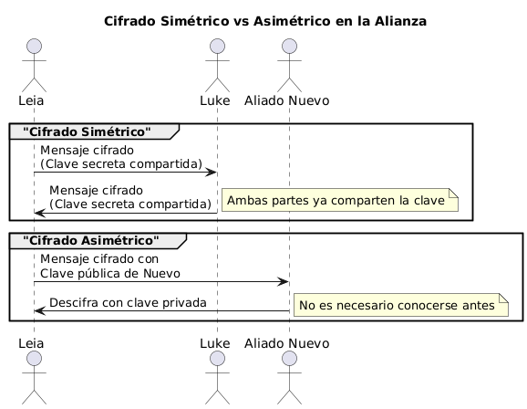

---

# Parte II – Misiones Prácticas con Cisco Packet Tracer: Guía Paso a Paso

---

## Misión 6: Red Troncal de la Alianza – Conectando Hoth, Home One y Endor

### **1. Selección de Dispositivos en Packet Tracer**

- **Routers:** 3 × Cisco 4321 (o 1941)
- **Switches:** 3 × Cisco 2960 (uno para cada base, opcional pero recomendado para simular varias PCs/servidores por LAN)
- **PCs:** Al menos 1 por LAN (simular usuarios en Hoth, HomeOne, Endor)

---

### **2. Estructura de la Topología**

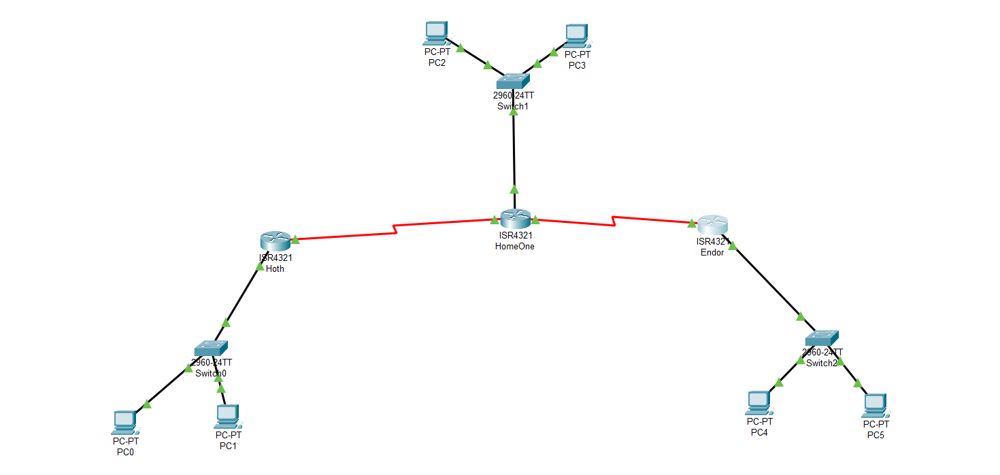

---

### **3. Tabla de Subredes y Direccionamiento**

| Segmento         | Red            | Máscara            | Gateway Router   | Rango de Hosts         | Broadcast      |
|------------------|----------------|--------------------|------------------|------------------------|---------------|
| Hoth-LAN         | 10.0.1.0/26    | 255.255.255.192    | 10.0.1.1         | 10.0.1.2 – 10.0.1.62   | 10.0.1.63     |
| HomeOne-LAN      | 10.0.1.64/27   | 255.255.255.224    | 10.0.1.65        | 10.0.1.66 – 10.0.1.94  | 10.0.1.95     |
| Endor-LAN        | 10.0.1.96/27   | 255.255.255.224    | 10.0.1.97        | 10.0.1.98 – 10.0.1.126 | 10.0.1.127    |
| Enlace Hoth-Home | 10.0.0.0/30    | 255.255.255.252    | 10.0.0.1/0.2     | 10.0.0.1-10.0.0.2      | 10.0.0.3      |
| Enlace Home-Endor| 10.0.0.4/30    | 255.255.255.252    | 10.0.0.5/0.6     | 10.0.0.5-10.0.0.6      | 10.0.0.7      |

---

### **4. Paso a Paso en Packet Tracer**

**a) Montaje Físico y Conexión:**
  1. Arrastra 3 routers Cisco 4321 y 3 switches Cisco 2960.
  2. Conecta cada router a su switch mediante cable straight a la interfaz G0/0.
  3. Conecta PCs a los switches.
  4. Conecta los routers entre sí usando cables seriales (añade módulo HWIC-2T si usas serial) o cables de cobre directo entre G0/1 y G0/2 (si usas GigabitEthernet en vez de Serial para enlaces WAN).

**b) Configuración de Interfaces (ejemplo en Router Hoth):**
```plaintext
Router> enable
Router# configure terminal
Router(config)# hostname Hoth
Hoth(config)# interface GigabitEthernet0/0
Hoth(config-if)# ip address 10.0.1.1 255.255.255.192
Hoth(config-if)# no shutdown
Hoth(config)# interface Serial0/0/0
Hoth(config-if)# ip address 10.0.0.1 255.255.255.252
Hoth(config-if)# no shutdown
```
Repetir en los otros routers con las IPs correspondientes.

**c) Configuración de OSPF en cada router:**
```plaintext
Hoth(config)# router ospf 1
Hoth(config-router)# router-id 1.1.1.1
Hoth(config-router)# network 10.0.1.0 0.0.0.63 area 0
Hoth(config-router)# network 10.0.0.0 0.0.0.3 area 0
```
En HomeOne:
```plaintext
HomeOne(config)# router ospf 1
HomeOne(config-router)# router-id 2.2.2.2
HomeOne(config-router)# network 10.0.1.64 0.0.0.31 area 0
HomeOne(config-router)# network 10.0.0.0 0.0.0.3 area 0
HomeOne(config-router)# network 10.0.0.4 0.0.0.3 area 0
```
En Endor:
```plaintext
Endor(config)# router ospf 1
Endor(config-router)# router-id 3.3.3.3
Endor(config-router)# network 10.0.1.96 0.0.0.31 area 0
Endor(config-router)# network 10.0.0.4 0.0.0.3 area 0
```

**d) Configuración de PCs (ejemplo Hoth):**
- IP: 10.0.1.10
- Máscara: 255.255.255.192
- Gateway: 10.0.1.1

**e) Verificación:**
- En cada router:  
  - `show ip ospf neighbor`  
  - `show ip route`

**Router Hoth**

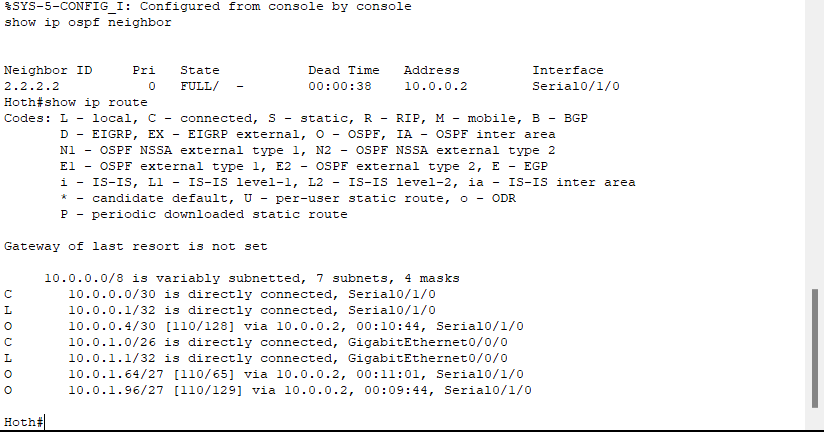

**Router HomeOne**

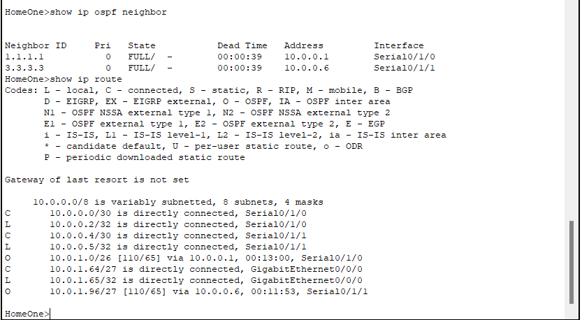

**Router Endor**

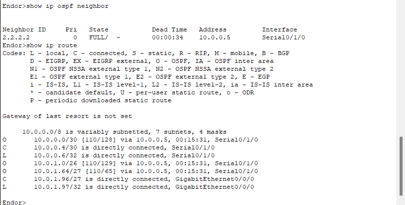


- Desde cualquier PC, intenta ping a una PC remota (ej. desde Hoth a HomeOne).

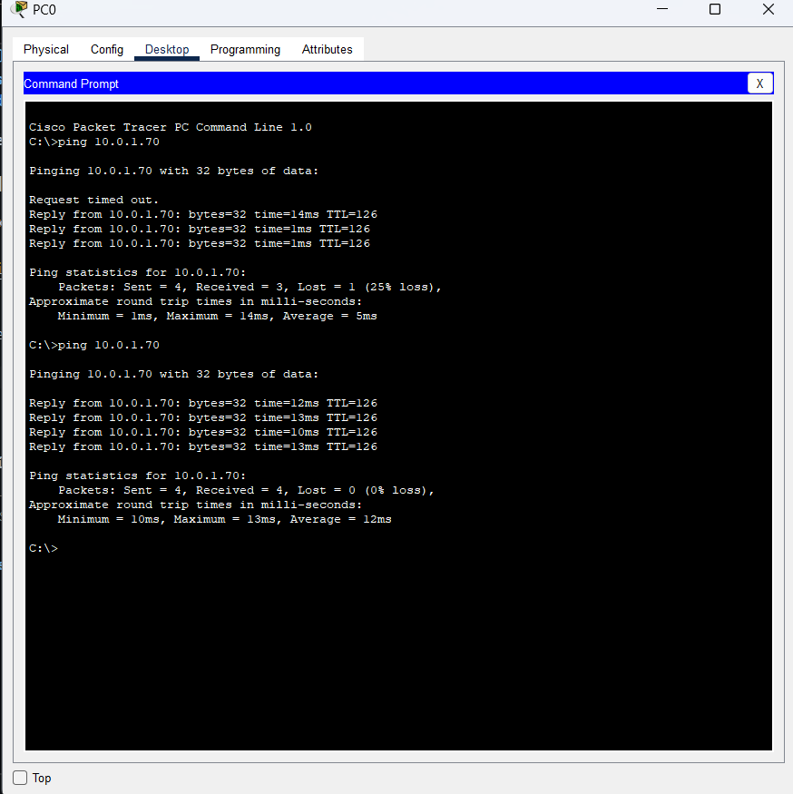


---

# Misión 7: La Baliza Secreta de Coruscant – Paso a paso en Cisco Packet Tracer

---

## **1. Dispositivos Necesarios**

- 2 Routers Cisco (recomendado: 4321 o 1941)
- 1 Switch Cisco 2960 (en Coruscant)
- 1 PC "Bothan" (en Coruscant)
- 1 PC "Control" (en la Flota)
- 1 Generic Server (en Coruscant)
- Cables: straight y serial (o cobre directo según módulos disponibles)

---

## **2. Topología a implementar**

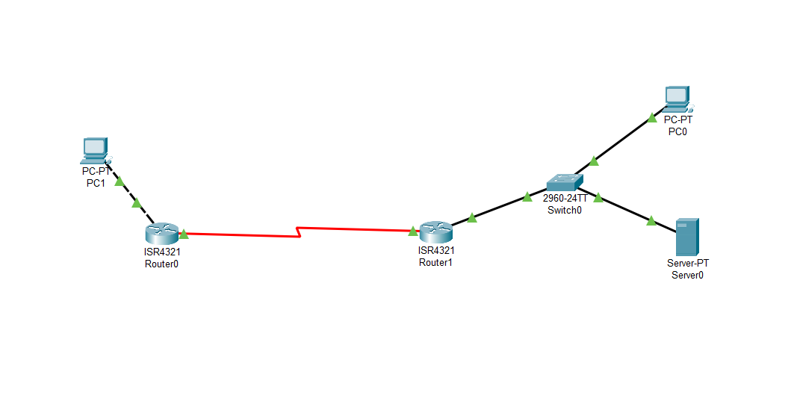

---

## **3. Direccionamiento y configuración IP**

### **LAN Coruscant (Switch Cisco 2960)**
- Servidor:  
  - IP: 192.168.50.100  
  - Máscara: 255.255.255.0  
  - Gateway: 192.168.50.1  
  - DNS: 192.168.50.100  
- PC Bothan:  
  - IP: 192.168.50.50  
  - Máscara: 255.255.255.0  
  - Gateway: 192.168.50.1  
  - DNS: 192.168.50.100  

### **LAN Flota**
- PC Control:  
  - IP: 192.168.60.50  
  - Máscara: 255.255.255.0  
  - Gateway: 192.168.60.1  
  - DNS: 192.168.50.100  

### **Enlace WAN (Serial/Ethernet entre routers)**
- Router Coruscant (WAN):  
  - IP: 10.0.0.9/30 (255.255.255.252)
- Router Flota (WAN):  
  - IP: 10.0.0.10/30 (255.255.255.252)

---

## **4. Paso a paso en Packet Tracer**

### **A. Montaje físico y conexiones**

1. Arrastra los routers, el switch, las PCs y el servidor a la mesa de trabajo.
2. Conecta:
   - PC Bothan y Server al Switch en Coruscant.
   - Switch al Router Coruscant (G0/0).
   - PC Control al Router Flota (G0/0).
   - Router Coruscant <-> Router Flota usando Serial DCE/DTE (S0/0/0) o Ethernet (G0/1↔G0/1).

---

### **B. Configuración de interfaces en los routers**

#### **Router Coruscant**
```plaintext
Router> enable
Router# configure terminal
Router(config)# hostname Coruscant
Coruscant(config)# interface GigabitEthernet0/0
Coruscant(config-if)# ip address 192.168.50.1 255.255.255.0
Coruscant(config-if)# no shutdown
Coruscant(config)# interface Serial0/0/0
Coruscant(config-if)# ip address 10.0.0.9 255.255.255.252
Coruscant(config-if)# clock rate 64000    ! Solo si es DCE
Coruscant(config-if)# no shutdown
```

#### **Router Flota**
```plaintext
Router> enable
Router# configure terminal
Router(config)# hostname Flota
Flota(config)# interface GigabitEthernet0/0
Flota(config-if)# ip address 192.168.60.1 255.255.255.0
Flota(config-if)# no shutdown
Flota(config)# interface Serial0/0/0
Flota(config-if)# ip address 10.0.0.10 255.255.255.252
Flota(config-if)# no shutdown
```

---

### **C. Rutas estáticas**

#### **Router Coruscant**
```plaintext
Coruscant(config)# ip route 0.0.0.0 0.0.0.0 10.0.0.10
```
*(Default route: todo lo que no sea 192.168.50.0/24 va a la Flota)*

#### **Router Flota**
```plaintext
Flota(config)# ip route 192.168.50.0 255.255.255.0 10.0.0.9
```
*(El tráfico hacia 192.168.50.0/24 va a Coruscant)*

---

### **D. Configuración del servidor DNS en Coruscant**

1. Haz clic en el Server (192.168.50.100).
2. Ve a la pestaña **Config** para la IP, y pon:
    - IP: 192.168.50.100
    - Máscara: 255.255.255.0
    - Gateway: 192.168.50.1
3. Ve a **Services > DNS**.
4. Activa DNS (ON).
5. Añade el registro:
    - Name: planes.secretos
    - Address: 192.168.50.100
    - Type: A

---

### **E. Configuración de IP y DNS en las PCs**

#### **PC Bothan**
- IP: 192.168.50.50
- Máscara: 255.255.255.0
- Gateway: 192.168.50.1
- DNS: 192.168.50.100

#### **PC Control**
- IP: 192.168.60.50
- Máscara: 255.255.255.0
- Gateway: 192.168.60.1
- DNS: 192.168.50.100

---

### **F. Configuración de SSH en Router Coruscant**

```plaintext
Coruscant(config)# ip domain-name rebelion.org
Coruscant(config)# crypto key generate rsa general-keys modulus 1024
Coruscant(config)# username admin secret S3cur3P@ss
Coruscant(config)# line vty 0 4
Coruscant(config-line)# transport input ssh
Coruscant(config-line)# login local
Coruscant(config)# service password-encryption
```

---

### **G. Pruebas y verificación**

1. **Ping entre PCs**:  
   - Desde PC Bothan a PC Control y viceversa.

   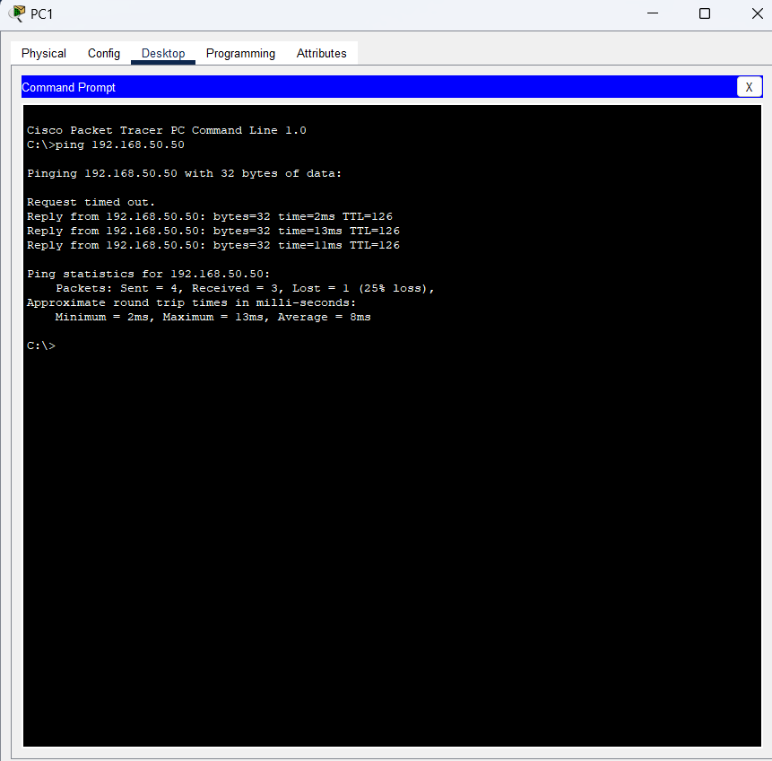

   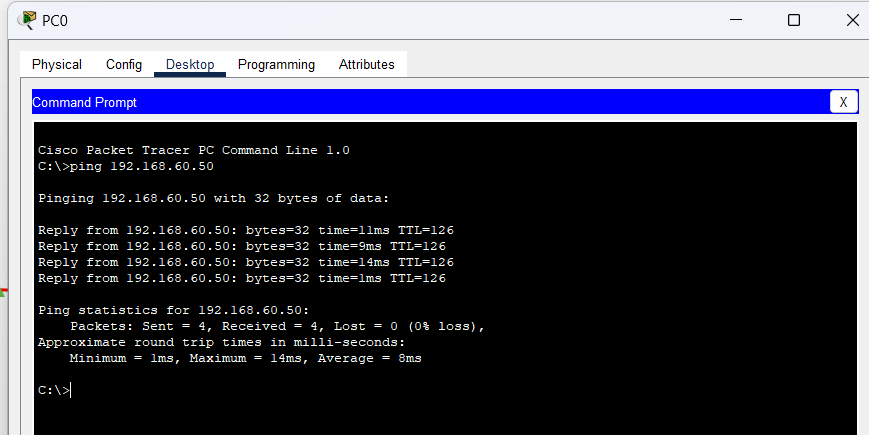


2. **Ping y DNS desde PC Control**:  
   - `ping planes.secretos`  
   - `nslookup planes.secretos`

   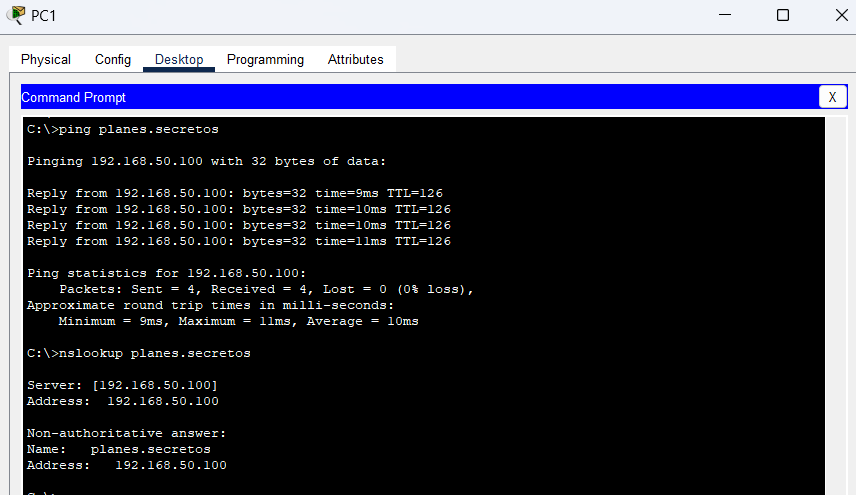

3. **Acceder vía SSH al Router Coruscant**:  
   - Desde PC Control, usa la app SSH (Desktop > SSH Client)  
   - Host: 10.0.0.9 o 192.168.50.1  
   - Usuario: admin  

    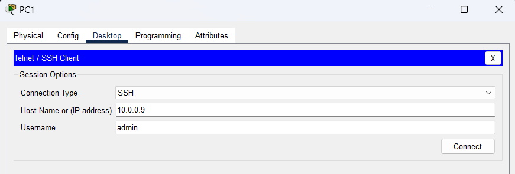

   - Contraseña: S3cur3P@ss

    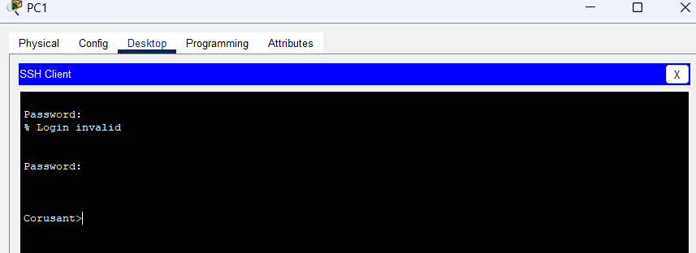


4. **(Opcional) Servicio HTTP**:  
   - En el Server, activa HTTP y edita la web con el mensaje secreto.  
   - Desde PC Control, intenta abrir http://planes.secretos en el navegador.

    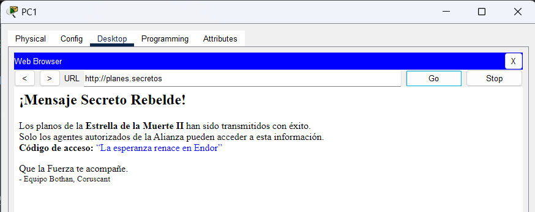

---

## **Resumen de comandos clave**

- Asignación de IPs a interfaces
- Rutas estáticas para interconexión
- Configuración de DNS y prueba de resolución
- Habilitación de SSH (clave RSA, usuario, líneas VTY)

---

**¡Misión cumplida, Jedi de la red! La seguridad y el sigilo de la Alianza están garantizados.**

## **Bibliografía**

1. [Definición y tipos de enrutamiento dinámico - Universidad VIU](https://www.universidadviu.com/es/actualidad/nuestros-expertos/definicion-y-tipos-de-enrutamiento-dinamico#:~:text=,IS)
2. [Sistema de nombres de dominio - Wikipedia](https://es.wikipedia.org/wiki/Sistema_de_nombres_de_dominio#:~:text=tipos%20de%20informaci%C3%B3n%20a%20cada,151%20de%20cada%20dominio)
3. [Características de TCP y UDP - LinkedIn](https://www.linkedin.com/advice/0/youre-trying-establish-network-connection-rwzie?lang=es&originalSubdomain=es#:~:text=1%20Caracter%C3%ADsticas%20de%20TCP)
4. [Cifrado simétrico vs asimétrico - Blog Mailfence](https://blog.mailfence.com/es/cifrado-simetrico-vs-asimetrico/#:~:text=El%20cifrado%20sim%C3%A9trico%20utiliza%20una,el%20mensaje%20se%20descifra%20correctamente)

---
